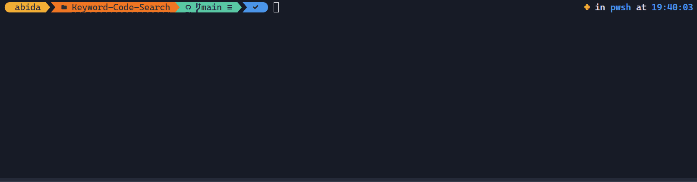

# Keyword-Based Code Search with GPT-4.1

This project provides a lightweight solution for performing keyword-based searches on your codebase and then uses GPT‑4.1 to generate detailed answers or explanations based on the relevant code snippets. The tool extracts context (two lines before and after each match) and builds a prompt including your question and the corresponding code snippets.



## Requirements
- Python 3.8+
- OpenAI Python library (for interacting with GPT‑4.1)
- An OpenAI API key with access to GPT‑4.1

## Installation

1. **Clone the repository:**

   ```bash
   git clone https://github.com/kingabzpro/Keyword-Code-Search.git
   cd Keyword-Code-Search
   ```

2. **Install dependencies:**

   ```bash
   pip install openai
   ```

## Environment Setup

Set your OpenAI API key in the environment variable:

- On macOS/Linux:

  ```bash
  export OPENAI_API_KEY="YOUR_API_KEY_HERE"
  ```

- On Windows (Command Prompt):

  ```cmd
  set OPENAI_API_KEY=YOUR_API_KEY_HERE
  ```


## Usage

This starts an interactive chat session where you can ask multiple questions about your codebase. The tool will search for relevant code snippets and provide AI-powered explanations for each question. Type 'quit' to exit the chat.
```bash
python main.py --path /path/to/your/codebase
```


## Supported File Types
The tool currently supports searching through the following file types:

- Python (.py)
- JavaScript (.js)
- Text files (.txt)
- Markdown (.md)
- HTML (.html)
- CSS (.css)
- Shell scripts (.sh)


## How It Works
1. The tool extracts keywords from your question
2. It searches through your codebase for files containing those keywords
3. It extracts relevant code snippets from the matching files
4. It sends the question and code snippets to GPT-4.1
5. GPT-4.1 generates an explanation based on the code snippets
6. The explanation is displayed in the terminal (with streaming)


## License

This project is released under the MIT License.
